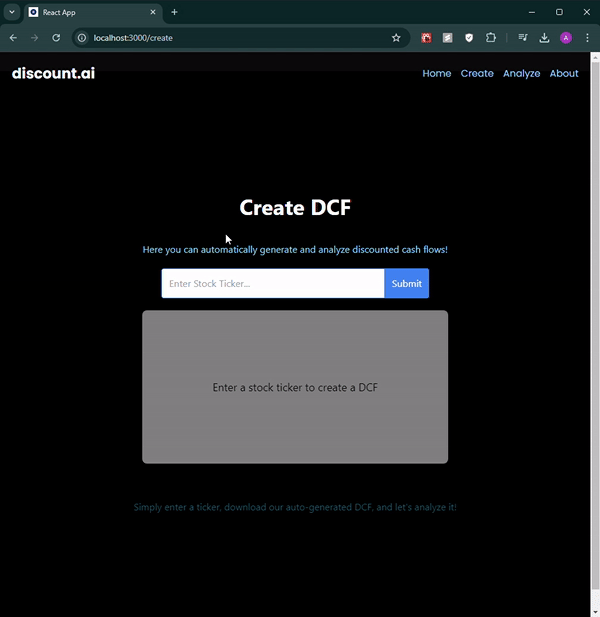

# discount.ai

## Overview

Discount.ai auto-generates financial valuation models based on historical data. Financial valuation models are essential in the investing industry, but they can take hours to manually develop, posing risks of inaccuracies and employee strain.

With simply a company ticker, our app will generate a custom discounted cash flow (DCF) model and provide it in a standardized report format, fully equipped with dynamic macros and linking to allow users to modify as desired. Users can then ask questions about the company and valuation through a language model (LLM) to understand more about the model and broader macro trends.

This project was developed during HackMIT 2023.

## Features

- **Auto-Generated DCF Models:** Quickly generate detailed DCF models using only a company ticker.
- **Interactive Analysis:** Ask questions about the company and valuation through a sophisticated LLM interface.
- **Dynamic Reports:** Receive reports with dynamic macros and linking for easy modification.
- **Market Data Integration:** Incorporate current market data and other relevant documents to enhance analysis.

## Demos

### Auto-Generated DCF Model and Interactive LLM Analysis

### Intro Website

## Installation

To run the project, you need to install the required dependencies for both the backend and frontend.

### Backend

1. Clone the repository:
   `git clone https://github.com/abhinavkolli03/discount.ai.git`

2. Navigate to the backend directory and install the required packages:
   `cd discount.ai/backend`
   `pip install -r requirements.txt`

### Frontend

1. Navigate to the frontend directory and install the required Node.js packages:
   `cd ../frontend`
   `npm install`

## Running the Application

### Start the Backend Server

1. In the backend directory, start the backend server:
   `python server.py`

### Start the Frontend Application

1. In the frontend directory, start the frontend application:
   `npm run dev`

## How to Use the Application

### Generating a DCF Model

1. Enter a company ticker in the provided input field.
2. Click on the "Generate DCF" button.
3. The app will generate a detailed DCF model and provide a downloadable report.

*Placeholder for an image or GIF showing how to generate a DCF model.*

### Interactive Analysis with LLM

1. Upload your financial documents or provide a DCF model for analysis.
2. Use the chat interface to ask questions about the company, the DCF model, and broader macroeconomic trends.
3. The LLM will provide detailed and contextually relevant responses.

*Placeholder for an image or GIF showing how to use the interactive LLM.*

## Understanding Discounted Cash Flow (DCF) Models

### What is a DCF?

A Discounted Cash Flow (DCF) model is a valuation method used to estimate the value of an investment based on its expected future cash flows. These cash flows are projected and then discounted back to the present value using a discount rate. The sum of these discounted cash flows provides an estimate of the investment's value.

### Key Components of a DCF Model

- **Cash Flow Projections:** Estimations of future cash flows over a specific period.
- **Discount Rate:** The rate used to discount future cash flows to their present value, often the weighted average cost of capital (WACC).
- **Terminal Value:** The value of the investment at the end of the projection period, accounting for future growth beyond the projection period.

### Values Calculated

- **Free Cash Flow (FCF):** Cash generated by the company after accounting for capital expenditures.
- **Net Present Value (NPV):** The sum of discounted cash flows over the projection period.
- **Internal Rate of Return (IRR):** The discount rate that makes the NPV of the investment zero.
- **Terminal Value:** Calculated using the perpetuity growth model or exit multiple approach.

## Tech Stack

- **Backend:** Flask, Python
- **Frontend:** React, JavaScript, Tailwind CSS
- **AI/ML:** TensorFlow, Google Vertex AI
- **Data Storage:** AWS S3, Pinecone

## Using the Polygon API

We used the Polygon API to gather financial metrics for the DCF calculations. The Polygon API provides detailed financial data such as balance sheets, income statements, and cash flow statements, which are essential for accurate DCF modeling. By leveraging this API, we ensure that the financial data used in the DCF models is up-to-date and accurate, providing reliable valuation estimates.

## Contributing

We welcome contributions from the community. Please fork the repository, make your changes, and submit a pull request. For major changes, please open an issue first to discuss what you would like to change.

## License

This project is licensed under the MIT License. See the [LICENSE](LICENSE) file for details.

## Contact

For more information, please contact [your email].
